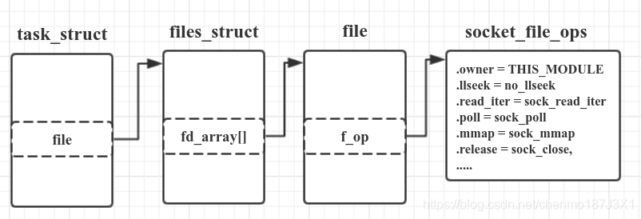
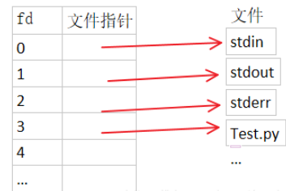
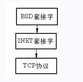

## BSD Socket层实现(一)

socket.c:系统调用通过INT $0x80进入内核执行函数，该函数根据AX寄存器中的系统调用号进一步调用内核网络栈相应的实现函数，对于socket、bind、connect、sendto、recvfrom等这些网络栈直接操作函数而言，socket.c文件中定义的函数是作为网络栈的最上层实现函数，也就是第一层被调用的函数。

对于标准的TCP/IP四层结构，我们通常将链路层称为L2层，依此类推，传输层即为L4层，应用层为L5层，socket.c文件中定义的函数集合可以称为L6层。即该文件中定义函数是一个通用的层面，它只是系统调用层与网络栈函数集合的接口层。BSD Socket层的主要实现就是socket.c。

 

> 前置知识：
>
> 普通文件操作表：Linux\include\linux\fs.h  struct  file_operations
>
> 该结构体中存放一系列函数指针，没有做具体实现。作为VFS,当有新文件系统注册时会进行具体的实现。
>
> ```cc
> struct file_operations {
> 	int (*lseek) (struct inode *, struct file *, off_t, int);
> 	int (*read) (struct inode *, struct file *, char *, int);
> 	int (*write) (struct inode *, struct file *, char *, int);
> 	int (*readdir) (struct inode *, struct file *, struct dirent *, int);
> 	int (*select) (struct inode *, struct file *, int, select_table *);
> 	int (*ioctl) (struct inode *, struct file *, unsigned int, unsigned long);
> 	int (*mmap) (struct inode *, struct file *, struct vm_area_struct *);
> 	int (*open) (struct inode *, struct file *);
> 	void (*release) (struct inode *, struct file *);
> 	int (*fsync) (struct inode *, struct file *);
> 	int (*fasync) (struct inode *, struct file *, int);
> 	int (*check_media_change) (dev_t dev);
> 	int (*revalidate) (dev_t dev);
> };
> 
> ```
>
> 这些函数将要是实现的功能：
>
> ```c
> llseek()   //修改文件指针
> read()    //从文件中读出若干个字节
> write()   //给文件中读出若干个字节
> mmap()    //文件到内存的映射
> open()    //打开文件
> flush()   //关闭文件或减少f_count计数
> release() //释放file对象（f_count=0)
> fsync()   //文件在缓存区的数据写回磁盘
> ```
>


在socket.c文件中，声明了Linux\include\linux\fs.h  struct  file_operations中的函数指针，并会做简单的实现，其实会调用下一层INET层做具体实现

**在建立连接后，用户空间进程使用普通文件操作方式来访问套接字，就是靠file_operations结构体的实例化：socket_file_ops**

```c
static int sock_lseek(struct inode *inode, struct file *file, off_t offset,
		      int whence);
static int sock_read(struct inode *inode, struct file *file, char *buf,
		     int size);
static int sock_write(struct inode *inode, struct file *file, char *buf,
		      int size);
static int sock_readdir(struct inode *inode, struct file *file,
			struct dirent *dirent, int count);
static void sock_close(struct inode *inode, struct file *file);
static int sock_select(struct inode *inode, struct file *file, int which, select_table *seltable);
static int sock_ioctl(struct inode *inode, struct file *file,
		      unsigned int cmd, unsigned long arg);
static int sock_fasync(struct inode *inode, struct file *filp, int on);
		   


/*
 *	Socket files have a set of 'special' operations as well as the generic file ones. These don't appear
 *	in the operation structures but are done directly via the socketcall() multiplexor.
 */
/*
结构体中声明的是网络协议对应的普通文件操作函数集合，从而使得read、write、ioctl等这些常见普通文件操作函数也可以被使用在网络接口的处理上

*/
static struct file_operations socket_file_ops = {
	sock_lseek,
	sock_read,
	sock_write,
	sock_readdir,
	sock_select,
	sock_ioctl,
	NULL,			/* mmap */
	NULL,			/* no special open code... */
	sock_close,
	NULL,			/* no fsync */
	sock_fasync
};

```



> files_struct中的fd_array[]表示该进程打开的所有描述符，对于套接字来说，与其他类型文件的区别就是最终f_op指向的是socket_file_ops。不过，可以看到，这里的socket_file_ops只有一些通用的操作，并没有send和recv。特有的操作通过 socketcall() 区分的。


> 前置知识：Linux内核对所有打开的文件有一个文件描述符表格，里面存储了每个文件描述符作为索引与一个打开文件相对应的关系，如下面的数组，文件描述符就是文件描述符表这个数组的下标，数组的内容就是指向一个个打开的文件的指针：
>
> 

用户使用socket系统调用编写应用程序时，通过一个数字表示socket，所有的操作都在该数字上进行，**这个数字称为套接字描述符**:

```c
/*
在socket系统调用处理函数sys_socket实现中，内核在分配inode、socket、sock结构后，调用get_fd获得一个文件描述符作为socket系统调用的返回值，因为分配文件描述符需要一个file结构，file结构中的f_inode字段即指向这个inode结构，每个file结构都有需要有一个inode结构对应。

*/

static int get_fd(struct inode *inode)
{
	int fd;
	struct file *file;

	/*
	 *	Find a file descriptor suitable for return to the user. 
	 */
    /*get_empty_filp()函数将返回一个空的file结构，内核会在内核里面维护一个files数组，这个数组将保存所有的file，这个函数将去遍历该数组，找到一个可用的数组元素，变为空返回给调用者，获得一个闲置的成员
    */
	file = get_empty_filp();
	if (!file) 
		return(-1);   //file结构分配失败，可能是files数组已经没有空的了

	for (fd = 0; fd < NR_OPEN; ++fd)
		if (!current->files->fd[fd]) 
			break;
	if (fd == NR_OPEN) 
	{
		file->f_count = 0;
		return(-1);
	}
/*
初始化，每当我们获得一个文件描述符时，能够对该文件描述符做read、write等操作都是初始化的结果
*/
	FD_CLR(fd, &current->files->close_on_exec);
		current->files->fd[fd] = file;
   
   // 此处的赋值可以实现网络操作的普通文件接口，可以调用socket_file_ops变量中对应的sock_read和sock_write函数
	file->f_op = &socket_file_ops;
	file->f_mode = 3;  //设置该文件能够读写，当然这个标志能够由用户改动
	file->f_flags = O_RDWR;
	file->f_count = 1;
  /*
  每一个文件都和一个inode相相应，该inode就是我们须要给本函数的inode 把用户提供的inode赋值给我们新建的file结构，这样这个file结构就和一个inode 唯一关联了，我们就能够通过控制该file来访问问存于文件系统里面的inode节点了。
  */
	file->f_inode = inode;
	if (inode) 
		inode->i_count++;
	file->f_pos = 0;
	return(fd);
}
```

**在系统调用的实现的函数中这个数字会映射成一个表示socket的结构体，该结构体保存了该socket的所有属性和数据，在BSD socket层，struct socket是在虚拟文件系统上被创建出来的。**

```c
struct socket {
  short			type;		//socket类型，比如TCP下使用的流式套接字SOCK_STREAM
  socket_state		state;
  long			flags;       
  struct proto_ops	*ops;		/* protocols do most everything	*/
  void			*data;		/* protocol data		*/
  struct socket		*conn;		/* server socket connected to	*/
  struct socket		*iconn;		/* incomplete client conn.s	*/
  struct socket		*next;
  struct wait_queue	**wait;		/* ptr to place to wait on	*/
  struct inode		*inode;
  struct fasync_struct  *fasync_list;	/* Asynchronous wake up list	*/
};
```


**结构体中的state用于表示socket所处的状态，是一个枚举变量，其类型定义如下：**

```c
//该成员只对Tcp socket有用，只要tcp是面向连接的协议

typedef enum{
    SS_FREE=0,
    SS_UNCONNECTED,         //未连向任何socket
    SS_CONNECTING,          //正在连接过程中
    SS_CONNECTED,           //已连向一个socket
    SS_DISCONNECTING        //正在断开连接的过程中
}socket_state
```


**socket与inode的关联：**

```c
/*在struct inode中最有一个变量是一个union结构，该结构定义了一系列针对不同文件系统的信息结构，对应ext2文件系统的ext2_i结构，对于网络而言对应socket_i结构，此时就是一个socket结构
*/

struct inode {
    ....
        
	union {
		struct pipe_inode_info pipe_i;
		struct minix_inode_info minix_i;
		struct ext_inode_info ext_i;
		struct ext2_inode_info ext2_i;
		struct hpfs_inode_info hpfs_i;
		struct msdos_inode_info msdos_i;
		struct umsdos_inode_info umsdos_i;
		struct iso_inode_info isofs_i;
		struct nfs_inode_info nfs_i;
		struct xiafs_inode_info xiafs_i;
		struct sysv_inode_info sysv_i;
		struct socket socket_i;
		void * generic_ip;
	} u;
};
```


**socket结构体与inode的分配并初始化**

```c
/*
sock_alloc函数分配并初始化一个socket和一个inode，二者是捆绑在一起的，如果成功则返回socket，如果inode创建出问题，则返回NULL。
*/


struct socket *sock_alloc(void)
{
	struct inode * inode;
	 * sock;
//git_empty_inode检查系统维护的一个inode结构数组，获取空闲的inode结构体
	inode = get_empty_inode();
	if (!inode)
		return NULL;

	inode->i_mode = S_IFSOCK;
	inode->i_sock = 1;
	inode->i_uid = current->uid;//用户ID,在后面调用bind系统调用时会进行对比
	inode->i_gid = current->gid;//组ID
     
    //下面对socket进行初始化操作
	sock = &inode->u.socket_i;
	sock->state = SS_UNCONNECTED;
	sock->flags = 0;
	sock->ops = NULL;
	sock->data = NULL;
	sock->conn = NULL;
	sock->iconn = NULL;
	sock->next = NULL;
	sock->wait = &inode->i_wait;
	sock->inode = inode;		/* "backlink": we could use pointer arithmetic instead */
	sock->fasync_list = NULL;
	sockets_in_use++;
	return sock;
}

```


**协议的操作函数集：**

```c
/*pops数组将在sock_register函数中被初始化，对于不同的操作域，具有不同的操作函数集
对应UNIX域的unix_pro_ops操作函数集，对应INET域的inet_proto_ops操作函数集
*/
static struct proto_ops *pops[NPROTO];

/*NPROTO的定义在linux/include/linux/net.h:
#define NPROTO		16		/* should be enough for now..	*/
*/
```


**proto_ops:  include/linux/net.h**

该结构体是BSD套接字与INET直接的桥梁



```c
/*
该结构体的定义在include/linux/net.h中，该结构体是具体的操作函数集合，是联系BSD套接字和INET套接字的接口，可以把BSD套接字看做是INET套接字的抽象
*/
struct proto_ops {
  int	family;

  int	(*create)	(struct socket *sock, int protocol);
  int	(*dup)		(struct socket *newsock, struct socket *oldsock);
  int	(*release)	(struct socket *sock, struct socket *peer);
  int	(*bind)		(struct socket *sock, struct sockaddr *umyaddr,
			 int sockaddr_len);
  int	(*connect)	(struct socket *sock, struct sockaddr *uservaddr,
			 int sockaddr_len, int flags);
  int	(*socketpair)	(struct socket *sock1, struct socket *sock2);
  int	(*accept)	(struct socket *sock, struct socket *newsock,
			 int flags);
  int	(*getname)	(struct socket *sock, struct sockaddr *uaddr,
			 int *usockaddr_len, int peer);
  int	(*read)		(struct socket *sock, char *ubuf, int size,
			 int nonblock);
  int	(*write)	(struct socket *sock, char *ubuf, int size,
			 int nonblock);
  int	(*select)	(struct socket *sock, int sel_type,
			 select_table *wait);
  int	(*ioctl)	(struct socket *sock, unsigned int cmd,
			 unsigned long arg);
  int	(*listen)	(struct socket *sock, int len);
  int	(*send)		(struct socket *sock, void *buff, int len, int nonblock,
			 unsigned flags);
  int	(*recv)		(struct socket *sock, void *buff, int len, int nonblock,
			 unsigned flags);
  int	(*sendto)	(struct socket *sock, void *buff, int len, int nonblock,
			 unsigned flags, struct sockaddr *, int addr_len);
  int	(*recvfrom)	(struct socket *sock, void *buff, int len, int nonblock,
			 unsigned flags, struct sockaddr *, int *addr_len);
  int	(*shutdown)	(struct socket *sock, int flags);
  int	(*setsockopt)	(struct socket *sock, int level, int optname,
			 char *optval, int optlen);
  int	(*getsockopt)	(struct socket *sock, int level, int optname,
			 char *optval, int *optlen);
  int	(*fcntl)	(struct socket *sock, unsigned int cmd,
			 unsigned long arg);	
};
```