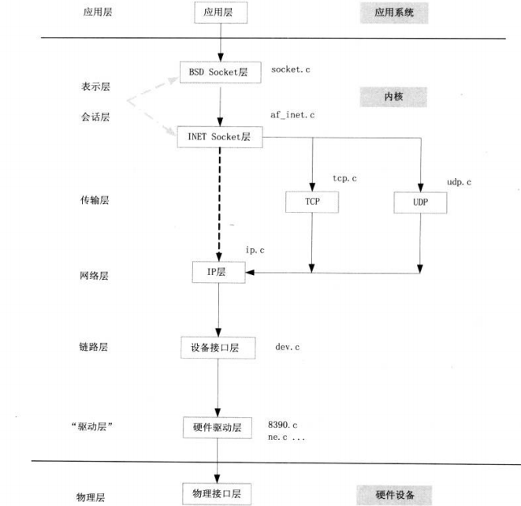

## BSD Socket层理解

BSD Socket**作为一种API**，允许不同主机或者同一个计算机上的不太进程之间的通信，BSD Socket的应用编程接口以及是网络套接字的事实上的抽象标准，但是**具体的实现是依赖os**，现代的操作系统都实现了BSD socket接口。

API函数：

- `socket()` 创造某种类型的套接字，分配一些系统资源，用返回的整数识别。

- `bind()` 一般是用在服务器这边，和一个套接字地址结构相连，比如说是一个特定的本地端口号和一个IP地址。

- `listen()`用在服务器一边，导致一个绑定的TCP套接字进入监听状态。

- `connect()` 用在客户机这边，给套接字分配一个空闲的端口号。比如说一个TCP套接字，它会试图建立一个新的TCP连接。

- `accept()` 用在服务器这边。从客户机那接受请求试图创造一个新的TCP连接，并把一个套接字和这个连接相联系起来。

- `send()` and `recv()`, or `write()` and `read()`, or `sendto()` and `recvfrom()`用来接收和发送数据。

- `close()` 关闭连接，系统释放资源。

- `gethostbyname()` and `gethostbyaddr()`用来解析主机名和地址。

- `select()` is used to prune a provided list of sockets for those that are ready to read, ready to write, or that have errors.

- `poll()` is used to check on the state of a socket in a set of sockets. The set can be tested to see if any socket can be written to, read from or if an error occurred.

- `getsockopt()` is used to retrieve the current value of a particular socket option for the specified socket.

- `setsockopt()` is used to set a particular socket option for the specified socket.

  **上述的API，在应用层通过系统调用，到达sys_socketcall入口函数，首先由BSD socket层进行实现，如accept系统调用在BSD socket层的实现是sock_accept，connect系统调用在BSD socket层实现的是sock_connect函数**

BSD socket层的实现大多集中在socket.c函数中：

BSD socker层的socket.c文件中函数的实现绝大多数都是简单调用下层函数，是网络栈的最上层，socket.c文件中定义的函数集合可以称为L6层。（链路层为L2层，传输层L4层，应用层L5层）

